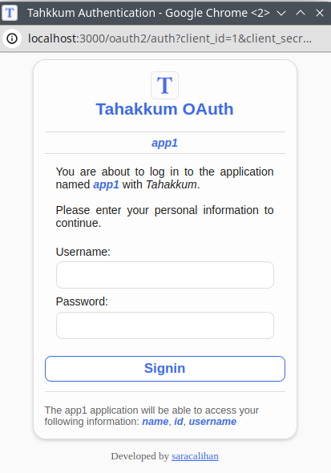

# Tahakkum

***tahakküm*** means domination, sovereignty in Turkish.
With this RESTFUL API, you can manage your users
access to resources, basic or token authentication and
authorization, use an OAuth-like registration system,
and monitor all these operations to `admin` and `moderator`
users.

This project does not provide an UI, it is only API.

> [!WARNING]
> This project is under development and developed for educational purposes.
> DON'T USE in the real world!

**Table of contents**:
+ [Setup](#setup)
  + [Install](#install)
  + [Build and Run](#build-and-run)
+ [Architecture](#architecture)
  + [Userflow](#userflow)
    - [Authentication](#authentication)
    - [OAuth](#oauth)
  + [Endpoints](#endpoints)
    - [Authentication](#authentication-endpoints)
      - [Register](#register)
      - [Login](#login)
      - [Me](#me)
    - [OAuth](#oauth-endpoints)
  + [Database](#database)
  + [Folder Structure](#folder-structure)
+ [Contributing](#contributing)
  + [Rules](#rules)
  + [Development](#development)
+ [License]

## Setup
This project is fully Dockerized. We use Docker and Docker Compose.
We dont have any fancy build steps. Just create container
then run it.

### Install

Clone this project using GIT

```bash
git clone git@github.com:saracalihan/tahakkum.git
```

Go into directory

```bash
cd tahakkum
```

### Build and Run

The api is already dockerized and we use postgre image with it.
We porting 3000 port to host machine so the 3000 port must be
free or you need to chage port in the `docker-compose.yaml` file.

This command builds and run the api then bridge it with postgres:

```bash
# docker-compose up
docker compose up
```

## Architecture

### Userflow

#### Authentication

This is basic user authentication unit.

Firstly, client should register itself with
`name`, `username`, `email`, `role` and `password`
data to `/authentication/register`. If the api
created user successfuly, the api send back data
to the client can check it.

Then, the client can login with `username`(or `email`,
key name must be `username`) and `password` on the
`/authentication/login`. If login is successful,
server send user data(without hiddens like `password_hash`,
`password_salt`) and access token, else api send
the reason of why client dont login.

Now, the client have an access token and can acccess to
all non-public routes with passing this token in header.

Also, the client get the token's data(`expireAt`, `status`, etc.)
`/authentication/me`
if the token is not expired or cancalled.

#### OAuth

If you don't store user's on Tahakkum but you want to other
Tahakkum users can login easyly in your system u can use
Tahakkum's OAuth system. You say what information you need
then if the user login successfuly we send an access token which
u can access to that information.

Firstly, You have to create an oauth app with personal access token,
if you dont have an access token please login. Pass your application's
`name`, `description`(_optional_), `homepage`(_optional_),
`photo`(_optional_), `scope`(wanted user fields, `id`, `name`,
`username`, `email`. Ex.: `"name,email"`) and `redirect_url`
(you can use `HTTP` or `HTTPS`) to `/oauth2/register-app`.
The api response is`client_id` and `client_secret` tokens.

An example of Tahakkum's OAuth interface:


Then, send a `GET` request to
`/oauth2/auth?client_id=<your_id>&client_secret=<your_secret>`.
If this secret values are valid, you get a HTML file and show it
to your user. If user can logged in successfuly, we redirect him
to the `redirect_url` with `access_token` value on the query.
For example, if your redirect url is `http://abc.com/login-with-tahakkum`,
the user redirected to the `http://abc.com/login-with-tahakkum?access_token=XXXX`.

After you handle the request and get to the oauth access token,
send `GET` request to the `/oauth2/user-info` url with `x-access-token`
header.

Example:

```http
GET /oauth2/user-info
"content-type": "application/json"
"x-access-token": "XXXX"
```

After successfully logged in:


If user enter wrong data:


An app without any description, logo and homapage:



### Endpoints

#### Authentication Endpoints
##### Register
Method: `POST`
Path: `/authentication/register`
Body: 
```js
{
  name: "string",
  username: "string",
  email: "string",
  password: "string",
  passwordAgain: "string"
}
```
response: 
```js
{
  name: "string",
  username: "string",
  email: "string",
  password: "string",
  passwordAgain: "string",
  createdAt: "Date",
  updatedAt: null,
}
```
status: `201`

##### Login
##### Me
### Database
`Todo: Not implemented yet!`

### Folder Structure
```bash
.
├── docker-compose.yaml # docker compose file
├── Dockerfile # docker file
├── LICENSE # GNU GPLv3 license
├── mvnw
├── mvnw.cmd
├── pom.xml
├── README.md
├── sample.env # example environment file, real file is `.env`
└── src
    ├── main
    │   ├── java
    │   │   └── com
    │   │       └── example
    │   │           └── tahakkum #main package
    │   │               ├── Application.java # server entry point
    │   │               ├── constant
    │   │               │   └── Roles.java
    │   │               ├── controller
    │   │               │   ├── AuthenticationController.java
    │   │               │   └── MainController.java
    │   │               ├── dto
    │   │               │   └── authentication
    │   │               │       ├── LoginDto.java
    │   │               │       └── RegisterDto.java
    │   │               ├── exception
    │   │               │   └── ResponseException.java
    │   │               ├── handler
    │   │               │   └── GlobalExceptionHandler.java
    │   │               ├── model
    │   │               │   ├── Role.java
    │   │               │   ├── Token.java
    │   │               │   └── User.java
    │   │               ├── repository
    │   │               │   ├── TokenRepository.java
    │   │               │   └── UserRepository.java
    │   │               ├── service
    │   │               │   ├── AuthService.java
    │   │               │   └── UserService.java
    │   │               └── utility
    │   │                   └── Cryptation.java
    │   └── resources
    │       ├── application.properties
    │       ├── static
    │       └── templates
    └── test

```

## Contributing

### Rules
If you want to contribute to the project, please first **check** 
if the work you are doing is already an **issue**. If there is an
issue and there is someone assigned to the issue, **contact that person**.
If there is no issue, you can send your development to the project
managers by opening a **pull request**. Please read [CONTRIBUTING.md](./CONTRIBUTING.md)

### Development
`Todo: Not implemented yet!`

### Contributers
<a href = "https://github.com/saracalihan/tahakkum/graphs/contributors">
  
</a>

## License
This project is under the [GPLv3 license](./LICENSE).
Also use Maven's license policy.
