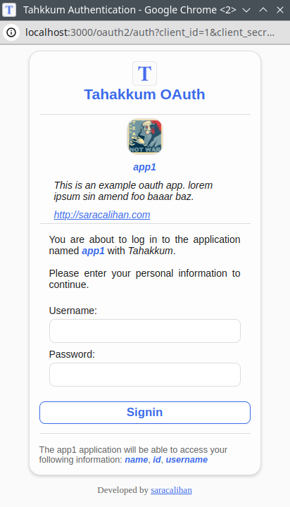
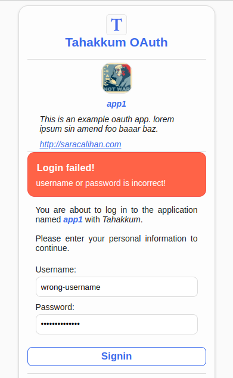

# Tahakkum


***tahakküm*** means domination, sovereignty in Arabic/Turkish.
With this RESTFUL API, you can manage your users
access to resources, basic or token authentication and
authorization, use an OAuth-like registration system,
and monitor all these operations to `admin` and `moderator`
users.

This project does not provide a UI, it is only API.

> [!WARNING]
> This project is under development and developed for educational purposes.
> DON'T USE in the real world!

**Table of contents**:
+ [Features](#features)
+ [Setup](#setup)
  + [Install](#install)
  + [Build and Run](#build-and-run)
+ [Architecture](#architecture)
  + [Userflow](#userflow)
    - [Authentication](#authentication)
    - [OAuth](#oauth)
    - [(T)OTP](#one-time-password)
  + [Endpoints](#endpoints)
    - [Authentication](#authentication-endpoints)
      - [Register](#register)
      - [Login](#login)
      - [Me](#me)
    - [OAuth](#oauth-endpoints)
      - [Register App](#register-app)
      - [OAuth](#oauth-1)
      - [Get User Info](#get-user-info)
      - [Login](#logininternal-use)
  + [Database](#database)
  + [Folder Structure](#folder-structure)
+ [Contributing](#contributing)
  + [Rules](#rules)
  + [Development](#development)
+ [License]

## Features

- [x] Username, password authentication
- [x] Access token authentication
- [x] access token authentication
- [x] OAuth token authentication(RESTful, UI)
- [x] Get user datail with oauth access token
- [ ] User CRUD
- [x] OTP, TOTP authentication(RESTful, UI)
- [ ] User role CRUD(a user has two roles, first is role related authorization and second is custom role like dealer, teacher, etc.)
- [ ] Authorization(path and role based)
- [ ] User blacklist for authorization
- [ ] One time accessable resources(paths)
- [ ] Operation monitoring(user's login attempts, user's tokens, routes and access couses)

## Setup
This project is fully Dockerized. We use Docker and Docker Compose.
We don't have any fancy build steps. Just create a container
then run it.

### Install

Clone this project using GIT

```bash
git clone git@github.com:saracalihan/tahakkum.git
```

Go into directory

```bash
cd tahakkum
```

### Build and Run

The api is already dockerized and we use postgre images with it.
We are porting 3000 ports to the host machine so the 3000 ports must be
free or you need to change the port in the `docker-compose.yaml` file.

This command builds and runs the api then bridges it with postgres:

```bash
# docker-compose up
docker compose up
```

## Architecture

### Userflow

#### Authentication

This is a basic user authentication unit.

Firstly, the client should register itself with
`name`, `username`, `email`, `role`, and `password`
data to `/authentication/register`. If the api
created user successfully, the api sent back data
to the client can check it.

Then, the client can log in with `username`(or `email`,
key name must be `username`) and `password` on the
`/authentication/login`. If login is successful,
server send user data(without hidden like `password_hash`,
`password_salt`) and access token, else api send
the reason why clients don't log in.

Now, the client has an access token and can access to
all non-public routes pass this token in the header.

Also, the client gets the token's data(`expireAt`, `status`, etc.)
`/authentication/me`
if the token is not expired or canceled.

#### OAuth

If you don't store users on Tahakkum but want other
Tahakkum users can log easyly in to your system u can use
Tahakkum's OAuth system. You say what information you need
then if the user login successfully we send an access token which
u can access that information.

Firstly, You have to create an oauth app with a personal access token,
if you don't have an access token please log in. Pass your application's
`name`, `description`(_optional_), `homepage`(_optional_),
`photo`(_optional_), `scope`(wanted user fields, `id`, `name`,
`username`, `email`. Ex.: `"name, email"`) and `redirect_url`
(you can use `HTTP` or `HTTPS`) to `/oauth2/register-app`.
The api response is`client_id` and `client_secret` tokens.

An example of Tahakkum's OAuth interface:




Then, send a `GET` request to
`/oauth2/auth?client_id=<your_id>&client_secret=<your_secret>`.
If these secret values are valid, you get an HTML file and show it
to your user. If the user can log in successfully, we redirect him
to the `redirect_url` with `access_token` value on the query.
For example, if your redirect url is `http://abc.com/login-with-tahakkum`,
the user was redirected to the `http://abc.com/login-with-tahakkum?access_token=XXXX`.

After you handle the request and get to the oauth access token,
send `GET` request to the `/oauth2/user-info` url with `x-access-token`
header.

Example:

```http
GET /oauth2/user-info
"content-type": "application/json"
"x-access-token": "XXXX"
```

After successfully logged in:


If user enter wrong data:



An app without any description, logo and homepage:


#### One Time Password
If you want to use two-step verification in your system,
you should send single-use codes to users using methods
such as mail, sms or 2 Factor Authenticator.

You can automate the steps of creating codes, sending codes
and verifying codes with Tahakkum.


**First**, after logging in with a developer account,
you need to create an OTP Application with the given
`x-access-token`. When creating the application,
it is sufficient to send the name of the application,
the address to which we will send the code when the
code is created, the method, the body, query and
header values ​​​​if any, the user information when the code
verification is successful and unsuccessful, and theaddress
to which we will send the `GET` request request to `/otp/register-app`
with the `POST` method. In response, with the `201` status code,

The code redirection process is completely dynamically managed
thanks to `codeRedirect` information. Once the code is created,
you can send REST requests in the format requested by your
service providers such as mail, sms or 2 Factor Authenticator and
send the code to your user.

> When you write the `__id__`, `__code__`, `__secret__` and
`__verifyUrl__` values ​​in a field other than `codeRedirectMethod`
within the `codeRedirect` values, Tahakkum automatically replaces
these words with values ​​specific to that user in the request it makes.

**To create a code**, you can send the `client_id`, `client_secret`
values ​​of your application to `/otp` with the `POST` method and
your user's tracking `metadata` content if you wish. It returns the
`id`, `secret`, `verifyUrl` information of the code with the
`201` code and sends the request to the `codeRedirect` address.

**If the mail or SMS request return error***, we will send you back
the message returned by that server with a `400` error code and
a body in the form of `status`, `message` and the generated code
will be cancelled.

> **The code is valid for 72 hours**. After this period, the code is expired.

**If you want to verify a code**, send the `code`, `id` and `secret`
values ​​to `/otp/verify` with the `POST` method. If the operation
is successful, you will be returned with `200` status code and
`metadata` information, if not, you will be given a `401` status code


**Time based one time code**, the operations are carried out in the
same way as `otp`.

To generate the code, send the `time` depth to `/otp/time-based` as
**seconds**(*2 seconds will be added to this time for the network*
*delay that will occur during the transmission of the code*).
To verify the code, send a request to `/otp/time-based/verify`.

**Important Note**
In both otp and totp processes, an interface URL that you can use to
verify the code is sent to you. Instead of using `verify` endpoints,
you can redirect your users directly to this address.

### Endpoints

#### Authentication Endpoints
##### Register
Method: `POST`
Path: `/authentication/register`
Body: 
```js
{
  name: "string",
  username: "string",
  email: "string",
  password: "string",
  passwordAgain: "string"
}
```
response: 
```js
{
  name: "string",
  username: "string",
  email: "string",
  password: "string",
  passwordAgain: "string",
  createdAt: "Date",
  updatedAt: null,
}
```
status: `201` or `400`

##### Login
Method: `POST`
Path: `/authentication/login`
Body: 
```js
{
  username: "string", // you can pass username or email as a value
  password: "string",
}
```
response:
```js
{
  user: {
    id: "number"
    name: "string",
    username: "string",
    email: "string",
    createdAt: "Date",
    updatedAt: null,
  },
  token:{
    value: "string",
    type: "AccessToken",
    status: "Active",
    expireAt: "Date",
    createdAt: "Date",
    updatedAt: "Date",
  }
}
```
status: `200` or `400`
##### Me
Method: `GET`
Path: `/authentication/me`
Header:
```js
{
  "x-access-token": "string" // your access token
}
```
response: 
```js
{
  user: {
    id: "number"
    name: "string",
    username: "string",
    email: "string",
    createdAt: "Date",
    updatedAt: null,
  },
  token:{
    value: "string",
    type: "AccessToken",
    status: "Active",
    expireAt: "Date",
    createdAt: "Date",
    updatedAt: "Date",
  }
}
```
status: `200` or `401`

#### OAuth Endpoints

##### Register App
Method: `POST`
Path: `/oauth2/register-app`
Header:
```js
{
  "x-access-token": "string" // your access token
}
```
Body:
```js
{
  name: "string",
  redirectUrl: "string",
  scopes: [
    "string", // id, email, name, username
  ]
  description: "string", // optional
  homePage: "string", // optional
  photo: "string", // optional
}
```
response:
```js
{
  id: "Long"
  clientSecret: "string"
  clientId: "string"
  name: "string"
  homepage: "string"
  photo: "string"
  description: "string"
  scopes: ["string"]
  redirectUrl: "string"
  owner: "User"
  createdAt: "date"
  updatedAt: "date"
  tokens: ["object"]
}
```
status: `201`, `400` or `401`
##### OAuth
Method: `GET`
Path: `/oatuh2/oauth`
Query:
```js
{
  client_id: "string" // your app's client_id
  client_secret: "string" // your app's client_secret
}
```
response:
```js
// this page return the oauth login html file
// That file redirect user to the app's redirect_url adress with access_token query
```
status: `301`, `400` or `401`
##### Get User Info
Method: `GET`
Path: `/oatuh2/user-info`
Header:
```js
{
  "x-access-token": "string"// oauth access token
}
```
response:
```js
// this route return the user's selected fields based on app's scopes data
```
status: `200` or `401`
##### Refresh Token
##### Login(internal use)
Method: `POST`
Path: `/oatuh2/login`
Query:
```js
{
  "token": "string"// validation token, generated by the server
}
```
Body:
```js
{
  username: "string",
  password: "string"
}
```
response:
```js
// This route redirect the client to the app's redirect_url adress with access_token query
```
status: `301` or `401`

#### Authentication Endpoints
##### Register
Method: `POST`
Path: `/authentication/register`
Body: 
```js
{
  name: "string",
  username: "string",
  email: "string",
  password: "string",
  passwordAgain: "string"
}
```
response: 
```js
{
  name: "string",
  username: "string",
  email: "string",
  password: "string",
  passwordAgain: "string",
  createdAt: "Date",
  updatedAt: null,
}
```
status: `201`

##### Login
##### Me
### Database
`Todo: Not implemented yet!`

### Folder Structure
```bash
.
├── docker-compose.yaml # docker compose file
├── Dockerfile # docker file
├── LICENSE # GNU GPLv3 license
├── mvnw
├── mvnw.cmd
├── pom.xml
├── README.md
├── sample.env # example environment file, real file is `.env`
├── src
├── main
│   ├── java
│   │   └── com
│   │       └── example
│   │           └── tahakkum
│   │               ├── Application.java
│   │               ├── constant
│   │               │   ├── Constants.java
│   │               │   ├── Roles.java
│   │               │   ├── TokenStatuses.java
│   │               │   └── TokenTypes.java
│   │               ├── controller
│   │               │   ├── AuthenticationController.java
│   │               │   ├── MainController.java
│   │               │   └── OAuthController.java
│   │               ├── dto
│   │               │   ├── authentication
│   │               │   │   ├── LoginDto.java
│   │               │   │   ├── LoginResponseDto.java
│   │               │   │   └── RegisterDto.java
│   │               │   └── oauth
│   │               │       └── request
│   │               │           └── AppRegister.java
│   │               ├── exception
│   │               │   └── ResponseException.java
│   │               ├── handler
│   │               │   └── GlobalExceptionHandler.java
│   │               ├── model
│   │               │   ├── OAuthApp.java
│   │               │   ├── OAuthToken.java
│   │               │   ├── Role.java
│   │               │   ├── Token.java
│   │               │   └── User.java
│   │               ├── repository
│   │               │   ├── OAuthAppRepository.java
│   │               │   ├── OAuthTokenRepository.java
│   │               │   ├── TokenRepository.java
│   │               │   └── UserRepository.java
│   │               ├── serializer
│   │               │   └── ResponseExceptionSerializer.java
│   │               ├── service
│   │               │   ├── AuthService.java
│   │               │   ├── TokenService.java
│   │               │   └── UserService.java
│   │               ├── template
│   │               │   └── oauth.html
│   │               └── utility
│   │                   ├── Cryptation.java
│   │                   └── UIBuilder.java
│   └── resources
│       ├── application.properties
│       ├── static
│       └── templates
└── test
```

## Contributing

### Rules
If you want to contribute to the project, please first **check** 
if the work you are doing is already an **issue**. If there is an
issue and there is someone assigned to the issue, **contact that person**.
If there is no issue, you can send your development to the project
managers by opening a **pull request**. Please read [CONTRIBUTING.md](./CONTRIBUTING.md)

### Development
`Todo: Not implemented yet!`

### Contributors
<a href = "https://github.com/saracalihan/tahakkum/graphs/contributors">
  
</a>

## License
This project is under the [GPLv3 license](./LICENSE).
Also, use Maven's license policy.
